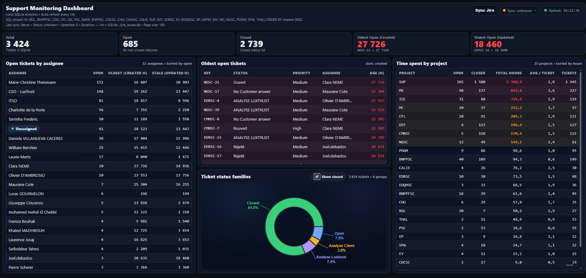

# Jira Support Dashboard

A lightweight **local support monitoring dashboard for Jira**.

This tool synchronizes Jira issues into a **local SQLite database** and exposes a **FastAPI dashboard** to visualize support activity in real time.

It is designed for **support teams and incident monitoring screens**.

---

# Features

- Automatic synchronization with Jira
- Local SQLite storage
- Real-time dashboard
- No external dependencies once built
- Fast startup
- Simple configuration using `.env`

Dashboard includes:

- Open tickets by assignee
- Top oldest open tickets
- Time spent by project
- Ticket statistics
- Automatic refresh

---

# Screenshot

---

# Installation

## 1 Clone the repository

git clone https://github.com/Lucas-Gourmelon/jira-support-dashboard.git  
cd jira-support-dashboard

---

## 2 Create environment file

Copy the example configuration:

cp .env.example .env

Edit `.env` and fill your Jira credentials.

Example:

JIRA_BASE_URL=https://your-domain.atlassian.net  
JIRA_EMAIL=your-email  
JIRA_API_TOKEN=your-api-token  
JIRA_JQL=updated >= -30d ORDER BY updated ASC  
JIRA_PAGE_SIZE=100  
SQLITE_PATH=./jira_issues.db  

---

# Running locally (development)

Create a virtual environment:

python -m venv .venv

Activate it:

.\.venv\Scripts\activate

Install dependencies:

pip install -r requirements.txt

Run the API:

.\run.ps1

The dashboard will be available at:

http://localhost:6441

---

# Building the standalone executable

Build the application:

.\build.ps1

The executable will be generated in:

dist/jira-support-dashboard.exe

---

# Running the executable

Place a `.env` file next to the executable.

Example structure:

dist
│
├─ jira-support-dashboard.exe
├─ .env
└─ logs

Then run:

jira-support-dashboard.exe

The server will start automatically.

---

# Environment variables

Variable | Description
--- | ---
JIRA_BASE_URL | Jira instance URL
JIRA_EMAIL | Jira account email
JIRA_API_TOKEN | Jira API token
JIRA_JQL | Query used to fetch issues
JIRA_PAGE_SIZE | Pagination size
SQLITE_PATH | SQLite database path
CLOSED_STATUS_LIST | Status names considered closed

---

# Security

The `.env` file contains credentials and is ignored by Git.

Never commit your `.env` file.

Use `.env.example` as a template.

---

# Technology stack

Python  
FastAPI  
SQLite  
Uvicorn  
PyInstaller  
Jinja2  

---

# Use cases

Support team monitoring  
Operations dashboard  
Incident tracking screen  
Jira analytics  
TV dashboard for support rooms  

---

# License

MIT
